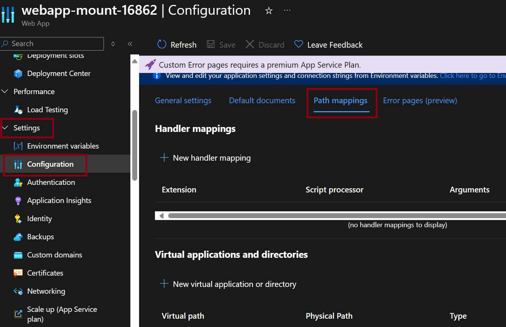
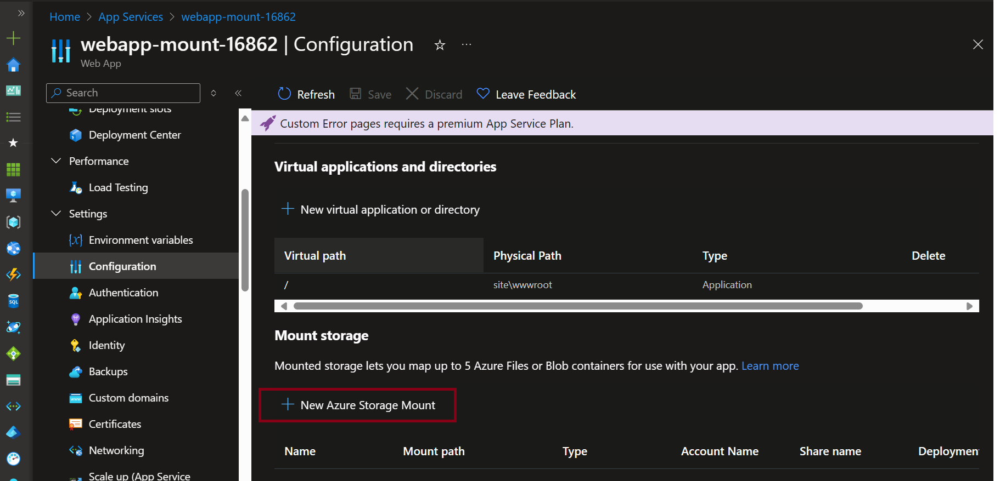
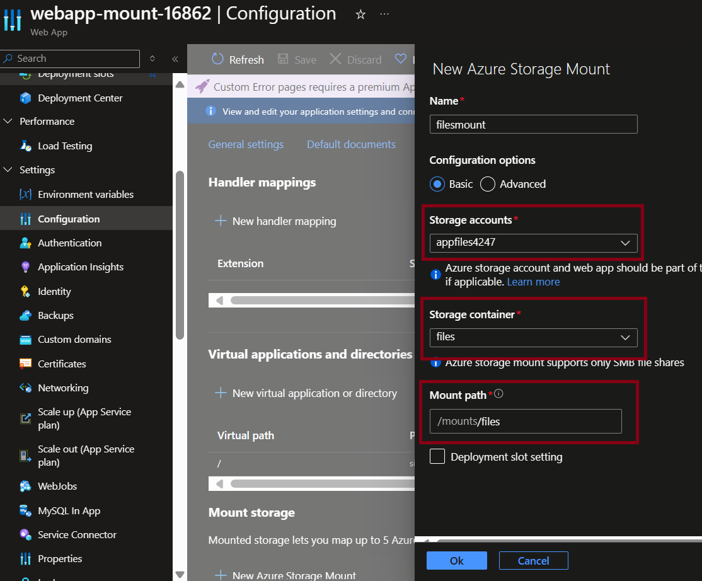

# Migration for ASP.NET to Azure App Services using Azure Files with System.IO

 
 
[](https://azure.microsoft.com)


## Scenario

The main objective of this LAB is do demonstrate the how to use System.IO to work with Azure Files in App Service. This is usefull to understand how to use System.IO to work with Azure Files, for migration of ASP.NET apps to App Services. The main document is https://learn.microsoft.com/en-us/azure/app-service/configure-connect-to-azure-storage?tabs=basic%2Cportal&pivots=code-windows


## Prerequisites
- An Azure account with an active subscription. [Create an account for free](https://azure.microsoft.com/free/?WT.mc_id=A261C142F).

## Create Environment
Create Resource Group

```bash
az group create \
    --name app-files-mount \
    --location brazilsouth
```

Create Azure Storage Account
```bash

export storageAccountName="appfiles$RANDOM"
az storage account create --resource-group app-files-mount --name $storageAccountName --location brazilsouth --kind StorageV2 --sku Standard_LRS --output none

```

Create File Share
```bash
shareName="files"

az storage share-rm create --resource-group app-files-mount --storage-account $storageAccountName --name $shareName --quota 128 --enabled-protocols SMB --output none

```

Create App Services Plan
```bash
appServicePlan="app-mount$RANDOM"
webapp="webapp-mount-$RANDOM"

az appservice plan create --name $appServicePlan --resource-group app-files-mount \
--location "brazilsouth"

# Create a Web App
az webapp create --name $webapp --plan $appServicePlan --resource-group app-files-mount

```
Go to recently created App Services, in Settings/Configuration, select Path Mapping



In Mount storage section, select + New Azure Storage Mount


Add a new Storage Mount
- give a name
- select the recently created storage account
- select the recently create files folder
- in mount path, type "files". The final mount path will be "/mounts/files" 




